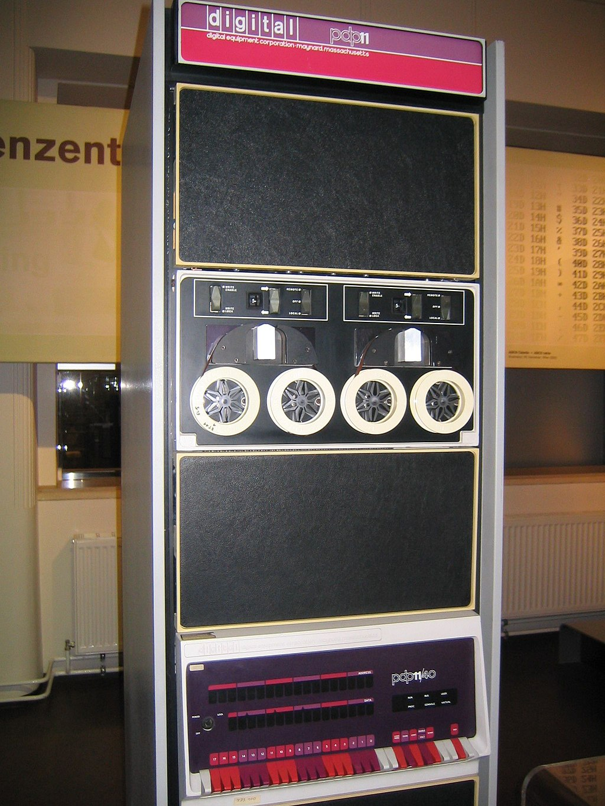

Soporte Técnico en Linux y en Programación
========================

Doy el apoyo técnico en las siguientes categorias:

1. Sistema Operativo Linux-UBUNTU

2. Problemas en la instalación en Utileria UBUNTU

3. Asesoramiento de lenguajes de programación: C, C++, Fortran, Python, Matlab

4. Asesoramiento en lenguages de programación para Estadística: R

5. Utilizar herramientas para analizar imagenes de resonancia magnéticia estructural y funcional: FSL, FreeSurfer, 

6. Hacer pipeline en BASH

7. Ayuda en la uteleria: grep, sed, 

.. image:: C_Logo.png
   :width: 5%

.. image:: MATLAB-Symbol.jpg
   :width: 10%

.. image:: Rlogo.png
   :width: 7%

.. image:: logo_c++.jpg
   :width: 7%

.. image:: logo_python.png
   :width: 7%

.. image:: ubuntu_logo.png
   :width: 10% 

Maquinas en mis tiempos:

.. image:: 1920px-DEC_VT100_terminal.jpg
   :width: 20%

